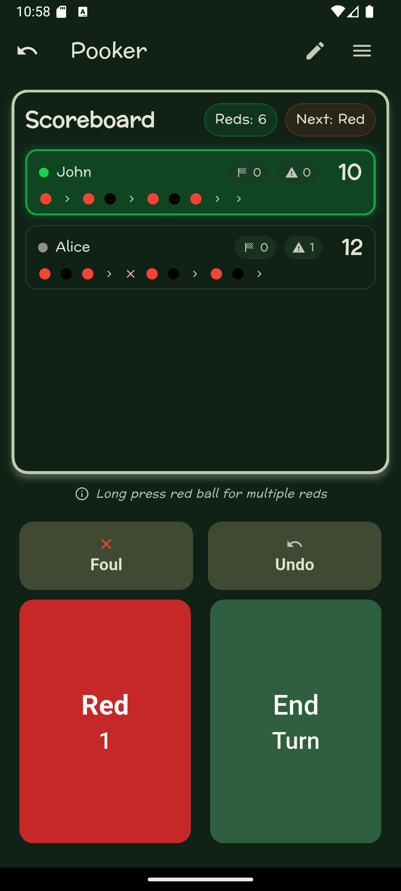

# Pooker

This app allows you to keep score in a pooker match.

Pooker is a way to play a snooker style game on a pool table. You can also play with a large number of people as you simply take turns to score points,

Pooker is played by assuming all balls except the black ball (8 ball) are "red balls" in snooker. And the black ball is the only "colour ball" in snooker. A red ball get's you 1 point and a black ball gets you 3 points.

|                                                                      ||
|----------------------------------------------------------------------|-|
|  ||
